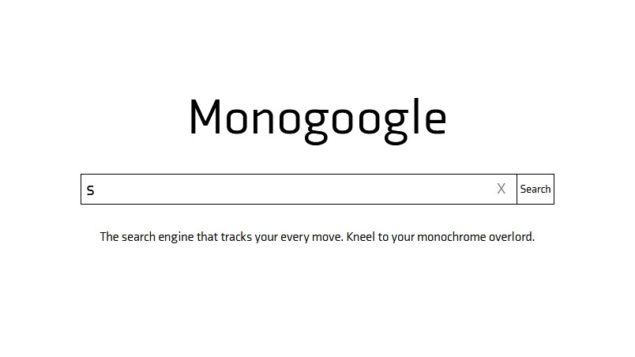

<p align="center">

</p>

# tonebase Technical Interview - FullStack (Front-End Focus)

Welcome to the tonebase Technical Interview! Congratulations, if you're here it means we think you'd make a great addition to the team, based on your past experience, personality and kick-ass skills!

This interview is a small/short test of those skills. Ideally the questions presented and the challenges involved should take no more than 1 hour for an experienced full-stack developer with React chops.

The initial portion of this interview is simply answering a few technical, front-end and React based questions. We can talk through these on a call as I'd love to hear how you think about them/through them!

#### Types of Questions

This interview has been created for someone who considers themselves a full-stack developer with a focus on the front-end. Very concretely what we mean by this is you feel comfortable spinning up an express server and handling MVC based routes, controlles and middleware... but you really feel at home diving into some React or Vue code and ironing out cross-browser bugs and optimizing SCSS patterns. Or you feel comfortable everywhere, which is even better :)

#### Our Stack

The questions below are informed by our stack. I will list the details of each below:

- Client
  - NextJS => Server Side React ([Github Link](https://github.com/zeit/next.js)) + MadeByWild Boilerplate ([Github Link](https://github.com/madebywild/wild-next))
  - Firebase Authentication ([Documentation](https://firebase.google.com/docs/auth))
  - React-Easy State Stores ([Github Link](https://github.com/solkimicreb/react-easy-state))
  - Segment Analytics
- Server/API
  - NodeJS/Express (custom, no off the shelf management system like SAILS)
    - Segment Analytics
- Database
  - Firebase Realtime Database (current)
  - MongoDB (future)
- Payment Processing
  - Chargebee (Subscription Management)
  - Stripe (Payment Processing)
- Marketing Technology
  - Intercom (soon to be removed)
  - FullStory
  - Attribution App
  - HelpScout
  - Customer.io
  - Amplitude
  - Google Analytics
  - SendGrid
  - Google Optimize (A/B, Multivariate)
  - Some others...
- Other
  - Vimeo (Video Hosting)
  - Figma (Design)
  - Canva (Design)
  - Premier (Video Editing) \* GIMP (Image Manipulation)

---

Okay, with all that out of the way let's dive into the question section!

### 1. What made you interested in/choose React as a framework? Was it a choice you made? Regardless, what is the one thing you enjoy most about it compared to other frameworks you've used and what is one thing you dislike about it?

I didn't choose to use React - it's part of the Thinkful curriculum where I learned full stack web development. I don’t have experience with any other frameworks so I can't compare, but I have been enjoying writing functional components with hooks. It's just quicker and simpler to write than class components.  

This probably isn't so much a problem with React, but with frameworks in general, but there is a lot of extra code, obviously necesssary. React is great for larger projects, especially where you can re-use components but in the small-scale projects I've been working on to learn three.js, I've been writing in raw html and js. With all of the extra code out of the way, it's easier to pinpoint where issues are and get an understanding of an entire project more quickly. Personally, I've also had some trouble finding good learning resources for three.js online, so I opted not to use React in case anyone interested in learning finds my three.js projects helpful.  

### 2. Why do the component names in JSX start with capital letters?

Components that start with lower-case letters default to html elements. Hence, <button> refers to the actual html element. If you have a custom button component you've made, you could name it 'Button', so if you use <Button>, React will use your custom component.   

### 3. What are the main types of components you can render in React? When do you choose one over the other?

The main types are class and functional components. Functional components are lighter, simpler, thus easier to write. They're best used if the component is purely visual, but with React hooks, you can implement features that are normally present in class components, such as state and lifecycle methods with useEffect().  

I can't say I know of any specific features functional components + hooks lack vs class components. I've begun defaulting to functional components and if there's something I need that React hooks can't cover, I'd switch to class components. So far I haven't run into that issue.  

### 4. How much experience do you have with testing frameworks? While our testing is light at the moment (read: nonexistent) this is something we'd like to move to in the future so this is a 'nice-to-know' for us!

I have a bit of experience using jest and enzyme for front-end testing though it's been a while since I've last done front-end testing. I was responsible for most of the back-end testing for Groop, a collaboration with three other people, where I used supertest, mocha, and chai, and am comfortable writing back-end tests.  

---

Whew, okay, now moving into a couple of code questions. We don't need you to code anything just yet, but this is more around optimization and undertstanding JS/React.

### 1. What is wrong with this example, and how would you go about fixing or improving the component?

```
class App extends React.Component {
  constructor(props) {
    super(props);
    this.state = {
      name: this.props.name || 'Anonymous'
    }
  }
  render() {
    return (
      <p>Hello {this.state.name}</p>
    );
  }
}
```

If state.name doesn't ever change, it's better to access the props value directly inside of the render function. 

If the name props changes, the corresponding state that was initiated in the constructor won't update with the new value. To fix this, the same thing can be done as above: use prop directly inside of the render function. And there's no need to have state anymore, which also means this can be a functional component.


### 2. What's the issue with this component. Why? How would you go about fixing it?

```
class App extends React.Component {
state = { search: '' }
handleChange = event => {
/**
     * This is a simple implementation of a "debounce" function,
     * which will queue an expression to be called in 250ms and
     * cancel any pending queued expressions. This way we can
     * delay the call 250ms after the user has stoped typing.
     */
    clearTimeout(this.timeout);
    this.timeout = setTimeout(() => {
      this.setState({
        search: event.target.value
      })
    }, 250);
  }
render() {
    return (
      <div>
        <input type="text" onChange={this.handleChange} />
        {this.state.search ? <p>Search for: {this.state.search}</p> : null}
      </div>
    )
  }
}
```

This will return an error. In React, event handlers return an instance of SyntheticEvent whose properties get set to null once the event callback is invoked. If you try to access it in an asynchronous function, it will return null. I would fix this by copying the event object or the specific key you want into a variable and using that inside the async function, like so:

```
let val = event.target.value;
```

And inside setState(), set search to our new variable:
```
search: val
```

---

Onto just a teensy bit of code + introducing you to our system! This part can be done on your own, and you can ping me when it's good to go!

Here is a link to a Github repo. containing our NextJS setup. It includes everything already setup for you -- SCSS support, a blank canvas for you to play with, and all the boileplate out of the way.

[The Github Repo.](https://github.com/tonebase/tonebase-interviews-fs-fe)

**Your challenge is to implement ONE of the following:**

1. OPTION 1: Implement a simple counter
  
  For this assignment you may use a state management system of your choice (other than the native React state). We recommend `react-easy-state` as that is our default tool and is extremely simple to get up and running.

  The counter should:

  (a) Increment UP once per hour between 9AM and 5PM (inclusive)

  (b) Increment DOWN once per hour between 6PM and 8AM (inclusive)

  (c) Increment UP when a button is clicked manually

  (d) Increment DOWN when a different button is clicked manually


2. OPTION 2: Build the Google homepage (www.google.com)

  Open-ended, go into as much or as little detail as makes sense to you. Responsiveness, functionality, modularity, etc. is all up to you -- we want to know how you interpret this prompt. Feel free to get as creative or keep it as simple as you would like. Your code will be evaluated along the following criteria:
  - Functionality
  - Creativity
  - Readability
  - Cleanliness
  - Comments
  - Modularity
  - Defensiveness
  - Declarative-ness


**When Complete**

When you're good to go with your implementation and/or happy with it feel free to make a P.R. into this repo. under a new branch titled `${ YOUR_NAME--FullStack--FrontEnd }`

---

Lastly, just a bit of writing! We are a company where members of the team are constantly shifting around/traveling, whether to China to manage our upcoming subsidiary there, or to New York and Europe to head productions, attend events, etc.

Thus writing, and the ability to write clearly, logically and to formulate arguments and answers is crucial at tonebase, whether a developer, PM, or A&R manager! These questions aim to give us a better understanding of you as a writer, as well as your development skills.

### 1. Tell me about componentWillMount and the issues with it?

componentWillMount is called right before the component is mounted. Because of this, if you make any asynchronous calls inside of it, the component will have already mounted by the time the asynchronous call finishes, and anything the component depends on that comes from that call will result in an error since it will be null.   

### 2. Can you walk me through the cycle of mounting a stateful component? What functions are called in what order? Where would you place a request for data from the API? Why?

The lifecycle methods that are called in order are componentWillMount -> componentDidMount -> componentWillUnmount -> componentDidUpdate ->componentWillUnmount. componentDidMount is called after the initial render. I'd place a request to the API in componentDidMount and not in WillMount due to the issues with rendering and the asynchronous nature of a request.  

### 3. If you had unlimited time budget and could fix / improve / change one thing in your last project, what would it be and why?

The last project I completed was this: https://3d-keyboard.now.sh, a 3D interactive keyboard. Since it's one of a series of small projects I am working on to learn three.js and build interactive webpages (I am working towards building a 3D interactive synthesizer), I wanted to keep it simple, but if I had unlimited time, I'd want to build deeper interactivity into it.  

An idea I had early on was to build a sort of keyboard customization webpage. In it's current state, I have one keyboard model loaded in. I'd like to make it so users can customize the keyboard and change attributes such as the keycap profiles, colors, switch types, and maybe add backlighting. I'd also like to build some light text-adventure features and make it into a sort of mini-game: display the text the user types on screen and build in different commands that change the environment when entered by the user. The way I envision it is similar to the game 'Stories Untold' (https://www.newgamenetwork.com/media/20291/stories-untold/).  

Why? I love doing 3D art and am passionate about games and interactive experiences, and since this is where it intersects with the web, I’m building on my skills so maybe I can make something cool someday.  

---

That's it! Now it's your time -- feel free to ask any questions you may have and we'd love to answer to the best of our abilities. Thank you so much for taking the time to do this quick interview - we can't wait to see your answers and see if there's a way for us to work together!

At tonebase we truly believe in the following principles:

1. To Educate & Inspire In Everything We Do
1. Think Big, Then Think Bigger
1. Align Around The Mission, Execute Against The Vision
1. Start And End With The Customer
1. Culture Doesn't Just Happen, It's Crafted

We'll let you know very soon if you've moved into the next phase of the interview. In the next step we will introduce you to the founders, our mission + vision, core company values and to our small, close-knit and wonderful team. We're all excited to see where things go and will be in touch ASAP.

If there's anything else or you need to get ahold of the team at any time, you can reach out to [<team@tonebase.co>](mailto:team@tonebase.co) or reach Abhi, co-founder and Head of Product at [<abhi@tonebase.co>](mailto:abhi@tonebase.co)
